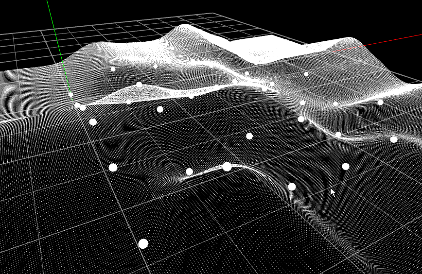

## Building an Orthonormal Basis
Frisvad, Jeppe Revall, "Building an Orthonormal Basis from a 3D Unit Vector Without Normalization"

Tom Duff, James Burgess, Per Christensen, Christophe Hery, Andrew Kensler, Max Liani, and Ryusuke Villemin, "Building an Orthonormal Basis, Revisited"

japanease super cool blog<br>
https://tyfkda.github.io/blog/2017/09/07/onb-revisited.html

## demo


## dependency
openframeworks 0.10.0

## for copy and paste (right hand coordinate system)

```

// Building an Orthonormal Basis, Revisited
inline void orthonormalBasis(const glm::vec3& zaxis, glm::vec3 *xaxis, glm::vec3 *yaxis) {
	float sign = copysignf(1.0f, zaxis.z);
	const float a = -1.0f / (sign + zaxis.z);
	const float b = zaxis.x * zaxis.y * a;
	*xaxis = glm::vec3(1.0f + sign * zaxis.x * zaxis.x * a, sign * b, -sign * zaxis.x);
	*yaxis = glm::vec3(b, sign + zaxis.y * zaxis.y * a, -zaxis.y);
}

```

## simple code test
```
	for (int i = 0; i < 10000; ++i) {
		glm::vec3 o(random.uniformf(-5.0f, 5.0f), random.uniformf(0.0f, 5.0f), random.uniformf(-5.0f, 5.0f));
		glm::vec3 zaxis = uniformOnUnitSphere(&random);

		// singularity test
		if (i % 1000 == 0) {
			zaxis = glm::vec3(0.0f, 0.0f, -1.0f);
		}

		glm::vec3 xaxis;
		glm::vec3 yaxis;
		orthonormalBasis(zaxis, &xaxis, &yaxis);

		ofSetColor(255, 0, 0);
		ofDrawLine(o, o + xaxis * 0.1f);

		ofSetColor(0, 255, 0);
		ofDrawLine(o, o + yaxis * 0.1f);

		ofSetColor(0, 0, 255);
		ofDrawLine(o, o + zaxis * 0.1f);

#if REVISITED
		// simple numerical test
		float a = glm::abs(glm::dot(xaxis, yaxis));
		if (1.0e-6f <= glm::abs(glm::dot(xaxis, yaxis))) {
			abort();
		}
		if (1.0e-6f <= glm::abs(glm::dot(yaxis, zaxis))) {
			abort();
		}
		if (1.0e-6f <= glm::abs(glm::dot(zaxis, xaxis))) {
			abort();
		}

		glm::vec3 maybe_zaxis = glm::cross(xaxis, yaxis);
		for (int j = 0; j < 3; ++j) {
			if (1.0e-6f <= glm::abs(zaxis[j] - maybe_zaxis[j])) {
				abort();
			}
		}
#else
		// simple numerical test
		float a = glm::abs(glm::dot(xaxis, yaxis));
		if (1.0e-4f <= glm::abs(glm::dot(xaxis, yaxis))) {
			abort();
		}
		if (1.0e-4f <= glm::abs(glm::dot(yaxis, zaxis))) {
			abort();
		}
		if (1.0e-4f <= glm::abs(glm::dot(zaxis, xaxis))) {
			abort();
		}

		glm::vec3 maybe_zaxis = glm::cross(xaxis, yaxis);
		for (int j = 0; j < 3; ++j) {
			if (1.0e-4f <= glm::abs(zaxis[j] - maybe_zaxis[j])) {
				abort();
			}
		}
#endif
	}
```